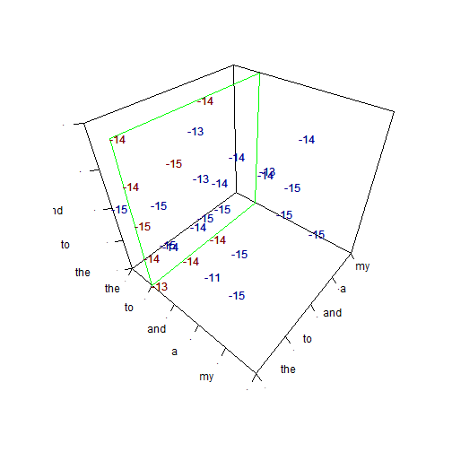

# FuzzyText
This is a demonstration project completed as a capstone to the [Johns Hopkins Data Science Specialization program on Coursera.org](https://www.coursera.org/specializations/jhudatascience). This project involved the creation of a natural langauge processing (NLP) model from unstrucutred text data and the deployment of that model in a Web application to predict the next word given an input phrase. This project was completed using the R statistical programming language and is fully reproducible. 

## Preparation Phase
Before a model can be developed, the data must be prepared for analysis and the current literature regarding the analysis of the type of data should be reviewed. 

In this phase the following steps were completed:

1. Data cleaning and preparation
2. Exploratory data analysis
3. Model theory and concept development

The [report linked here](http://rpubs.com/wmurphyrd/97195) describes the proceses and results from this phase. 

## Implementation phase
In the implementation phase, the proposed model was developed and deployed as a Web application. The following steps were completed in this phase:

* The development of a novel smoothing algorithm using a multi-dimensional vector space projection to represent the Markov probabilities of all possible phrases

Figure 2 from "How Fuzzy Smoothing Works" in the [presentation](http://rpubs.com/wmurphyrd/fuzzytext). 
* Speed and memory use optimizations to fit the target hardware (mobile devices)
* Evaluation of model performance
* Creation and deployment of Web application with user interface

The [presentation linked here](http://rpubs.com/wmurphyrd/fuzzytext) describes the fuzzy smoothing algorithm, details the optimizations, and reports the predicted accuracy. The final product can be viewed at [https://wmurphyrd.shinyapps.io/FuzzyTextPredictor](https://wmurphyrd.shinyapps.io/FuzzyTextPredictor). 

